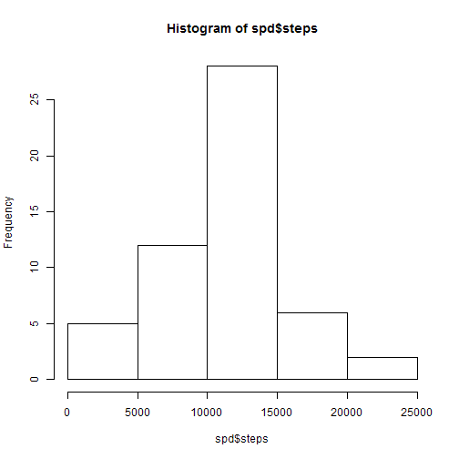

Reproducible Research: Peer Assessment 1
=========================================
  
## Loading and preprocessing the data
This code reads the file "activity.csv" and loads into a dataframe named "raw", then transforms the "date" column to the appropriate data type.  


```r
raw <- read.csv("activity.csv",header=TRUE,stringsAsFactors=F)
raw[[2]] <- as.Date(raw$date)
```

## What is mean total number of steps taken per day?
**1. Make a histogram of the total number of steps taken each day**


```r
spd <- aggregate(steps ~ date, data=raw, FUN=sum, na.rm=TRUE)
hist(spd$steps)
```

 

**2. Calculate and report the mean and median total number of steps taken per day**  
The mean is 10,766.19 steps and the median is 10,765 steps as shown by the ensuing code.


```r
mean(spd$steps)
```

```
## [1] 10766.19
```

```r
median(spd$steps)
```

```
## [1] 10765
```
  
    
## What is the average daily activity pattern?
**1. Make a time series plot (i.e. type = "l") of the 5-minute interval (x-axis) and the average number of steps taken, averaged across all days (y-axis)**
  

```r
spi <- aggregate(steps ~ interval, data=raw, FUN=mean,na.rm=TRUE)
with(spi,plot(interval,steps,type="l"))
```

 
  
**2. Which is the 5 minute interval with max number of steps**  
The interval 835 is the interval with the max number of steps as shown by the ensuing code.

```r
spi[spi$steps==max(spi$steps),]
```

```
##     interval    steps
## 104      835 206.1698
```
  
  
## Imputing missing values
**1.Calculate and report the total number of missing values in the dataset (i.e. the total number of rows with NAs)**  
There are 2,304 rows with missing values.  


```r
sum(is.na(raw$steps))
```

```
## [1] 2304
```
    
**2. Devise a strategy for filling in all of the missing values in the dataset. The strategy does not need to be sophisticated.**  
The strategy used was to set all NA values to Zero  

**3.Create a new dataset that is equal to the original dataset but with the missing data filled in.**  
The new dataset is called "clean"  

```r
clean <- raw
clean[is.na(clean)]<-0
```
  
**4. Make a histogram of the total number of steps taken each day and Calculate and report the mean and median total number of steps taken per day.**  
**Do these values differ from the estimates from the first part of the assignment?**  
**What is the impact of imputing missing data on the estimates of the total daily number of steps?**  
  

```r
spd2 <- aggregate(steps ~ date, data=clean, FUN=sum, na.rm=TRUE)
hist(spd2$steps)
```

 

  
The values differ from the intial calcualtion, since there are no more NA values the number of observations included in the calculation increases. Given that the cleaning strategy was to set missing values to zero, the mean and the media are now lower.
  

```r
mean(spd2$steps)
```

```
## [1] 9354.23
```

```r
median(spd2$steps)
```

```
## [1] 10395
```
  
  
## Are there differences in activity patterns between weekdays and weekends?  
Yes, the patterns differ between weekdays and weekends.  
  
**1.Create a new factor variable in the dataset with two levels -- "weekday" and "weekend" indicating whether a given date is a weekday or weekend day.**  
The new factor variable is called "wday".
  

```r
clean$wday <- as.factor(ifelse(weekdays(clean$date) %in% c("Saturday","Sunday"),"weekend","weekday"))
```
  
**2. Make a panel plot containing a time series plot (i.e. type = "l") of the 5-minute interval (x-axis) and the average number of steps taken, averaged across all weekday days or weekend days (y-axis).**  
  

```r
library(lattice)
mspd <- aggregate(steps ~ interval+wday, data=clean, FUN=mean, na.rm=TRUE)
xyplot(steps~interval|wday,data=mspd, type="l", layout=c(1,2), ylab="Number of steps")
```

 
  


